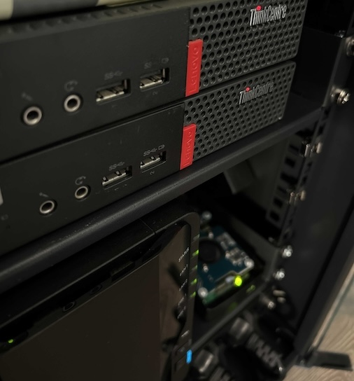
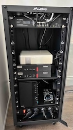
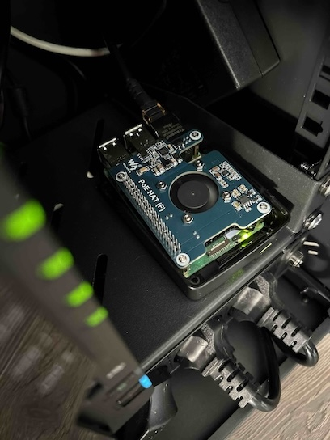
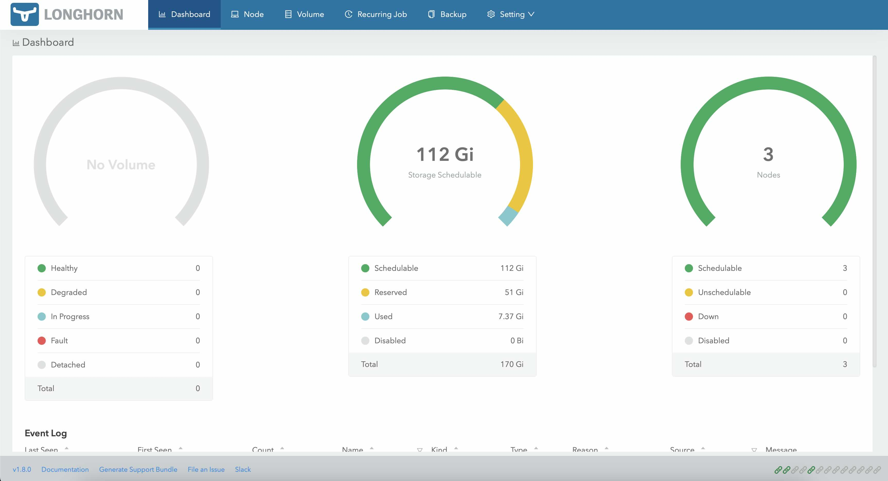

# Homelab

## Why building Homelab? 
I created this homelab just to have fun and as a place for my hacking ideas, where I can build, experiment, test, adjust, and break things. I want to constantly sharpen my skills, and such a physical environment is a great place for that. Some people might say, "Yeah... but why not just use VMs?" It's all about having fun the feeling the impact! Connecting to your physical hardware from your couch and knowing it’s running in your "cave" is a totally different experience. Besides, the issues I face when building on physical hardware are slightly different from those I encounter when working in often-managed cloud infrastructure.

---

---
## Hardware 
Rack: Lanberg 10" 
Switch: Lanberg - 8x Fast Ethernet 2x Upstream Gigabit Ethernet

Nodes: 
    - 2x Lenovo ThinkCentre M910Q i5 16GB Ram Intel HD Graphics 256GB SSD
    - RasberyPi 5 8GB 64GB 

Power:
    - Qoltec PDU 10"

Accesories: 
    - 2x 64GB USB mini (one per worker node)

## Goals
- Keep as much as possible inside the cluster
- Moore to come... 

## Infrastructure
I decided to provision my infrastructure as k3s cluster. If you want to find more about my lab architecture please go to [MY Cluster](./docs/INFRASTRUCTURE.md)

## Network
I would like to have one entry point to my Homelab cluster as most of the time we have when using managed cloud kubernetes services. Because normaly that would be external component I decided to use MetalLB Load Balancer.

Configuration [MetalLB Configuration](./docs/METALLB_CONFIG.md)

## Storage
One USB 64GB Drive per Node for persistent volume to gather logs. This is managed by Longhorn tool.

## Monitoring
Who want's some cool looking dashboards? Obviously Prometheus + Grafana

## Automation
For automation currently I'm using Ansible to configure and manage my nodes. When I'll provision AKS than I'll add automation for that part. 
