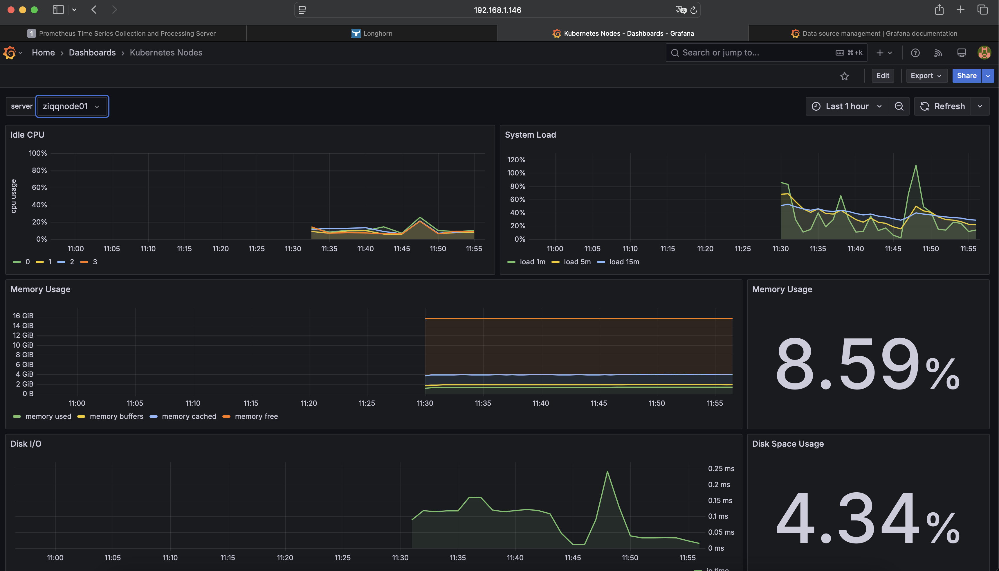

1. After installing and configuring storage + prometheus, the next step is to levrage Grafana as tool for displaying metrics.

```bash
## Create persistent volume for saving grafana dashboards

kubectl apply -f grafana-pvc.yaml  


## Create deployment
kubectl apply -f deployment.yml 

## Create service account
ubectl apply -f service-account.yml 

## Expose grafana by creating service
kubectl apply -f service.yml
```

2. Now Grafana UI should be accesible from IP 192.168.1.146:3000
Default login and password ```admin:admin``` 

3. Add connection the dashboard
- Click Connections in the left-side menu.
- Under Your connections, click Data sources.
- Select the data source to which you want to assign permissions.
[Reference](https://grafana.com/docs/grafana/latest/administration/data-source-management/?utm_source=grafana_gettingstarted)

4. Import graphs. 
On the main Grfana screen click import dashboard from Grafana.com
Type graph number: 8171
Select data provider as Prometheus
Click load and provide Prometheus IP - configured in srvice and assigned by load balancer
And...boom!



[Back - Homepage](../README.md)