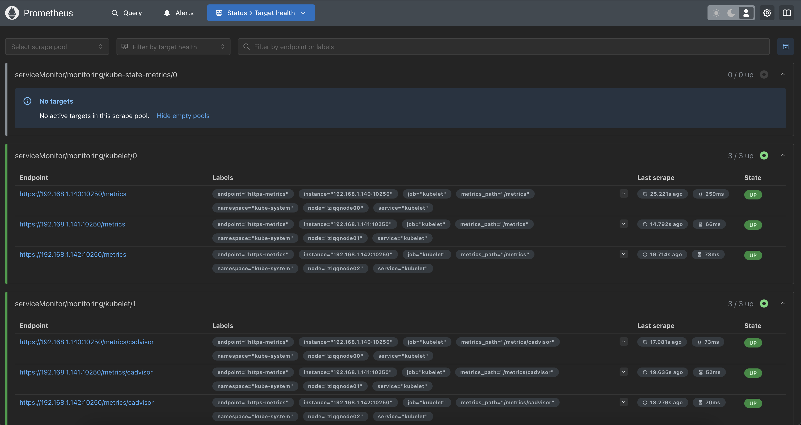

## Prometheus and Grafana

Installing and configuring base promehteus and grafana are quite simple when using tailored helm chart. Let's jump straight to it:

1. Apply chart to monitoring namespace
```bash
kubectl apply --server-side -f ./charts/prometheus-operator/bundle.yaml
```

2. Check if pod is running

3. Create service monitor for longhorn storage created previously
```bash
❯ kubectl apply --server-side -f longhorn-servicemonitor.yml
```

4. Check if deamon is running
```bash
kubectl get daemonset -n longhorn-system
```

5. Create service account, rbac roles, assignments and node exporter deamon to extract metrics from nodes
```bash
kubectl apply -f ./cluster-role-binding.yaml  

kubectl apply -f ./cluster-role.yaml 

kubectl apply -f ./service-account.yaml 

kubectl apply -f ./service.yaml 

kubectl apply -f ./deamon-set.yaml 

kubectl apply -f ./service-monitor.yaml 

```

6. Create service that listens to the Kubernetes API, and generates metrics about the state of the objects.
Applay all at once:
```bash
kubectl apply -f kube-state-metrics/
```
7. Check if all are running
```bash
kubectl get pods -n monitoring

NAME                                   READY   STATUS    RESTARTS   AGE
node-exporter-6vzbc                    2/2     Running   0          38m
node-exporter-fdmpr                    2/2     Running   0          38m
node-exporter-nqcpt                    2/2     Running   0          38m
prometheus-operator-566dcdd6f7-4qqqk   1/1     Running   0          52m

```

8. Create service monitor for Kublet as an important part of infrastructure. (Not all data is collected by service state metric - some information can be collected only from Kubelet).

```bash
kubectl apply -f kubelet-servicemonitor.yaml 
```

9. Traefik service monitor
```bash
kubectl apply -f traefik-servicemonitor.yaml
```

10. Expose Prometheus Service 
```bash
kubectl apply -f prometheus.yml 

kubectl apply -f service.yml 

kubectl apply -f service-local.yml 

kubectl apply -f prometeus-serviceacount.yaml

kubectl apply -f service-account.yml 

## add permissions for this account to look into other namespaces, and collect data
kubectl apply -f prometeus-rbac-role-binding.yaml 

## RBAC gives permissions to access various resources
kubectl apply -f prometeus-rbac-clusterrole.yaml
```

Check if pods are running
```bash
kubectl get pods -n monitoring

NAME                                   READY   STATUS    RESTARTS   AGE
node-exporter-6vzbc                    2/2     Running   0          58m
node-exporter-fdmpr                    2/2     Running   0          58m
node-exporter-nqcpt                    2/2     Running   0          58m
prometheus-operator-566dcdd6f7-4qqqk   1/1     Running   0          72m
```
11. Prometheus should be accesible via external IP - in my example this is 192.168.1.145


[Back - Homepage](../README.md)